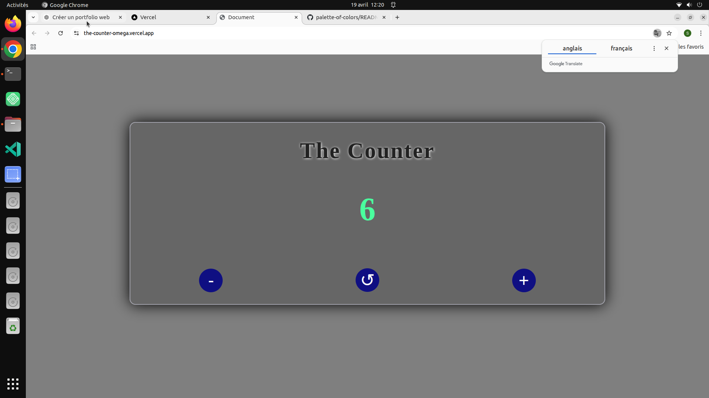

# 🔢 The Counter

A simple and interactive counter application built with HTML, CSS, and JavaScript.

---

## 🔗 Live Demo
https://the-counter.vercel.app

## 📂 GitHub Repository
https://github.com/saidhadjadj/the-counter

---

## 🌍 Overview
This project is a basic counter application that allows users to increment, decrement, and reset a value. It demonstrates core JavaScript interactions and UI updates.

---

## ✨ Features
- ➕ Increment counter
- ➖ Decrement counter
- 🔄 Reset functionality
- ⚡ Real-time UI updates
- 📱 Fully responsive design

---

## 📸 Preview

---

## 🛠️ Tech Stack
- HTML5
- CSS3
- JavaScript (ES6)

---

## 🎯 Purpose
This project demonstrates basic state management, event handling, and DOM manipulation.

---

## 👤 Author
Said Hadjadj
